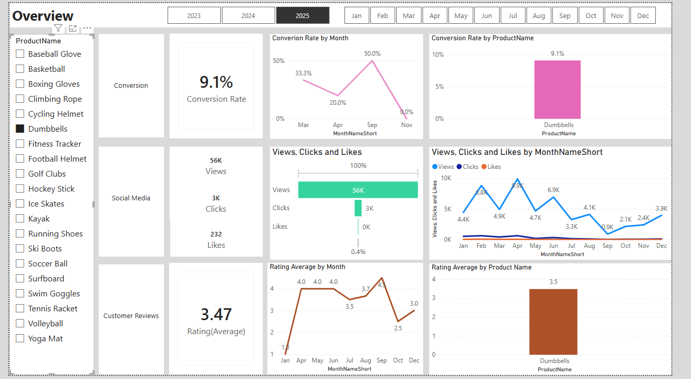
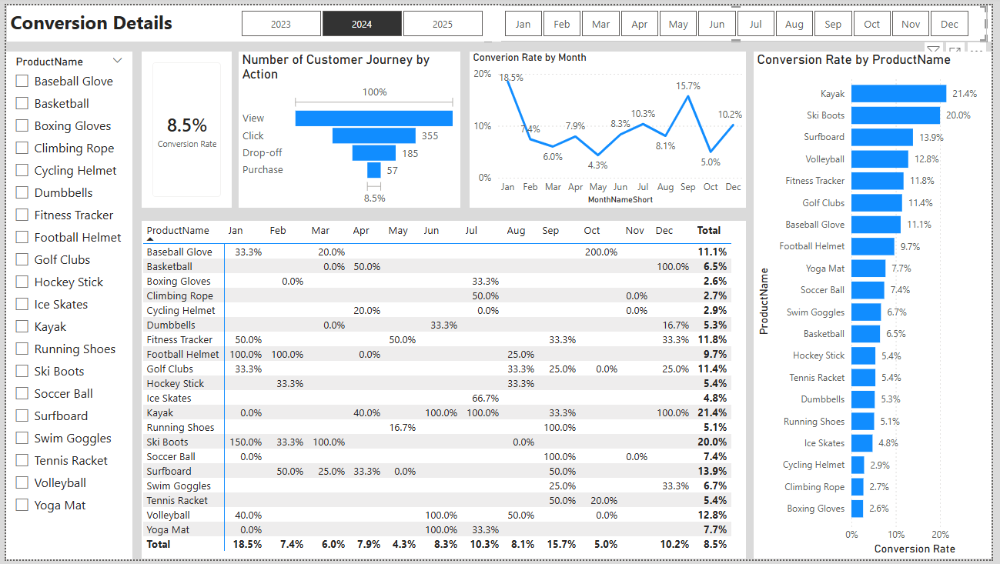
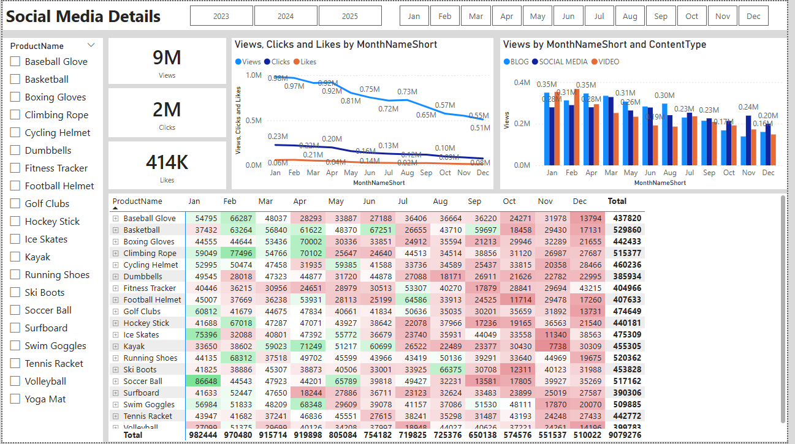
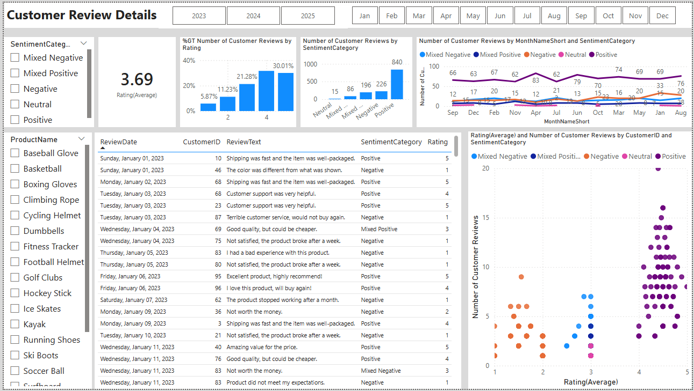

# Customer Conversion & Marketing Effectiveness Sentiment Analytics

> Diagnosing why increased marketing spend was failing to convert and what to do about it.

## Overview Dashboard

## Business Problem

Businesses increase their marketing budgets, run new campaigns, test different channels and yet conversion rates keep declining and customer engagement keeps dropping. This project was built to answer the question no one could point to: **why?**

This end to end analytics diagnostic was built for a B2C e commerce brand experiencing:

Declining customer conversion rates over a two year period  
Significant drop in customer engagement across content channels  
Rising marketing expenses with diminishing returns  
Unstructured customer feedback with no systematic analysis

## Tools & Technologies

| Layer                     | Tool       |
| ------------------------- | ---------- |
| Data Storage & Querying   | SQL Server |
| Sentiment Analysis        | Python     |
| Visualization & Reporting | Power BI   |

## Dataset

Archived SQL database transactional and behavioral customer data

Excel files customer feedback forms and product reviews

## KPIs Tracked

Conversion Rate  
Customer Engagement Rate  
Average Order Value (AOV)  
Customer Feedback Score

## Goals & Key Insights

### 1. Identify factors impacting conversion rate

**Insight:** Conversion rate declined from 11.4% (2023) to 8.4% (2025), with predictable seasonal peaks in January and September. Products like Kayaks, Ski Boots, and Baseball Gloves consistently outperformed yet budget allocation wasn't reflecting this. Focus marketing efforts on high converting products and capitalize on seasonal peaks with targeted campaigns.

### 2. Determine which content drives the highest engagement

**Insight:** Customer engagement dropped ~50%, from 1M to 500K views, with October to December bottoming out below 15K views per product. Blog content led on volume but not on action. CTAs were underutilized at the most critical touchpoints. Experiment with interactive video and user generated content, and optimize CTA placement especially during the historically low engagement window (Sept to Dec).

### 3. Understand common themes in customer feedback

**Insight:** Average customer rating sat at 3.69/5, with 39% of reviews below 4 stars. Sentiment analysis on free text reviews surfaced 3 to 4 recurring complaint themes that structured ratings alone would have missed. Implement a structured feedback loop, develop improvement plans around the most common issues, and follow up with dissatisfied customers to encourage re rating targeting a 4.0 average.

## Key Findings at a Glance

| Metric                  | Finding                                                                     |
| ----------------------- | --------------------------------------------------------------------------- |
| Conversion Rate         | Dropped from 11.4% (2023) to 8.4% (2025); peaks in Jan & Sept underutilized |
| Customer Engagement     | ~50% reduction in views (1M to 500K); Oct to Dec below 15K views/product    |
| Average Customer Rating | 3.69 / 5 below the 4.0 target; 61% of reviews above 4 stars                 |
| Average Order Value     | ~$205 stable, ruling out pricing as the root cause                          |

## Dashboard Pages

| Page                |
| ------------------- |
| Overview            |
| Conversion Analysis |
| Engagement Analysis |
| Customer Feedback   |

## Screenshots

### Conversion Rate Analytics Dashboard

### Social Media Analytics Dashboard

### Customer Review/Sentiment Analytics Dashboard

## Recommendations Summary

1. **Reallocate marketing budget** toward high converting product categories and double down on January and September campaigns

2. **Overhaul content strategy** shift from volume focused blogging to interactive and user generated formats with stronger CTAs

3. **Close the feedback loop** systematically track mixed and negative reviews, address recurring themes, and re engage dissatisfied customers

## Author

**Guneet Singh**  
[LinkedIn](YOUR_LINKEDIN_URL)
